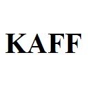

# ⚡ KAFF İkas Otomasyonu


**KAFF İkas Otomasyonu**, İkas e-ticaret panelinde ürün varyantlarını toplu olarak yönetmenizi sağlayan güçlü bir Chrome Extension'dır. Fiyat güncelleme, stok kontrolü ve görsel yükleme işlemlerini tek tıkla gerçekleştirin!

---

## 🎯 Özellikler

### 💰 Toplu Fiyat Güncelleme
- Tüm varyantların fiyatlarını tek seferde güncelleyin
- React state senkronizasyonu ile %100 uyumlu
- Anlık güncelleme ve doğrulama

### 📦 Toplu Stok Güncelleme
- Tüm varyantların stok miktarlarını aynı anda ayarlayın
- Otomatik popup açma/kapama
- Her varyant için kaydetme işlemi

### 🖼️ Otomatik Görsel Yükleme
- Klasör bazlı görsel organizasyonu
- Akıllı varyant eşleştirme algoritması
- Çoklu model desteği (örn: "S25-S24-S23 Ultra")
- Her varyanta doğru görselleri otomatik yükleyin

### 🛡️ Gelişmiş Hata Yönetimi
- **Retry Mekanizması**: Bağlantı hatalarında 3 kez otomatik yeniden deneme
- **Timeout Kontrolü**: 30 saniye üzeri işlemlerde otomatik durdurma
- **Büyük Dosya Kontrolü**: 10MB üzeri dosyalar atlanır
- **Boş Dosya Kontrolü**: 0 byte dosyalar otomatik filtrelenir
- Kullanıcı dostu hata mesajları

---

## 📋 Sistem Gereksinimleri

- **Tarayıcı**: Google Chrome 88+ veya Microsoft Edge 88+
- **İşletim Sistemi**: Windows 10/11, macOS, Linux
- **İkas Hesabı**: Aktif İkas e-ticaret paneli erişimi
- **Dosya Boyutu**: Görsel dosyaları maksimum 10MB

---

## 🚀 Kurulum

### Adım 1: Dosyaları İndirin
```bash
# Git ile klonlayın
git clone https://github.com/veyselkilicerkan/kaff-ikas-otomasyon.git

# veya ZIP olarak indirin
# GitHub'dan "Code" → "Download ZIP"
```

### Adım 2: Chrome'a Yükleyin

1. **Chrome'u açın** ve adres çubuğuna şunu yazın:
   ```
   chrome://extensions
   ```

2. **Geliştirici Modunu** açın (sağ üst köşede)
   
3. **"Paketlenmemiş öğe yükle"** butonuna tıklayın

4. İndirdiğiniz **klasörü seçin** (`kaff-ikas-otomasyon`)

5. ✅ Extension yüklendi! Sağ üst köşede KAFF logosunu göreceksiniz.

---

## 📖 Kullanım Kılavuzu

### 🔹 Fiyat Güncelleme

1. İkas panelinde **ürün varyant sayfasına** gidin
   - Örnek URL: `https://yourstore.ikas.com/admin/products/12345/variants`

2. KAFF extension **logosuna tıklayın**

3. **"Fiyat Güncelleme"** bölümünde:
   - Yeni fiyatı girin (örn: `1299`)
   - **"Tüm Fiyatları Güncelle"** butonuna tıklayın

4. ✅ Tüm varyantların fiyatları anında güncellenir!

**💡 İpucu**: Ondalıklı fiyatlar için virgül yerine nokta kullanın (örn: `1299.99`)

---

### 🔹 Stok Güncelleme

1. İkas panelinde **ürün varyant sayfasına** gidin

2. KAFF extension'ı açın

3. **"Stok Güncelleme"** bölümünde:
   - Yeni stok miktarını girin (örn: `10000`)
   - **"Tüm Stokları Güncelle"** butonuna tıklayın

4. ⚠️ Onay penceresi çıkacak → **"Tamam"** deyin

5. ⏳ İşlem biraz sürebilir (her varyant için popup açılıp kapanır)

6. ✅ Tüm varyantların stokları güncellenir!

**⚙️ Teknik Not**: Stok güncelleme, İkas'ın popup mekanizmasını kullandığı için fiyat güncellemeden daha uzun sürer.

---

### 🔹 Görsel Yükleme (En Güçlü Özellik!)

#### Klasör Yapısı Hazırlığı

Görsel klasörünüzü şu şekilde organize edin:

```
📁 Telefon Kılıfları/
├── 📁 1-17 Pro Max - Pro/
│   ├── 📷 foto1.jpg
│   ├── 📷 foto2.jpg
│   └── 📷 foto3.jpg
├── 📁 7-S25-S24-S23-S22 Ultra/
│   ├── 📷 foto1.jpg
│   ├── 📷 foto2.jpg
│   └── 📷 foto3.jpg
└── 📁 10-s22 - s22 Plus/
    ├── 📷 foto1.jpg
    └── 📷 foto2.jpg
```

**📌 Önemli Kurallar:**
- Her model için **ayrı klasör** oluşturun
- Klasör isimleri **varyant isimlerine benzer** olmalı
- Sadece **`.jpg` veya `.jpeg`** dosyaları kullanın
- Dosya boyutu **maksimum 10MB**

#### Yükleme Adımları

1. İkas panelinde **ürün varyant sayfasına** gidin

2. KAFF extension'ı açın

3. **"Görsel Yükleme"** bölümünde:
   - **"Klasör Seç"** butonuna tıklayın
   - Ana görseller klasörünü seçin

4. ✅ Durum mesajı: "📁 12 klasör, 36 JPG hazır."

5. **"Tüm Görselleri Yükle"** butonuna tıklayın

6. ⏳ Extension her varyant için:
   - Eşleşen klasörü bulur
   - O klasördeki tüm görselleri yükler
   - İlerleme konsolda gösterilir

7. ✅ Başarı mesajı alırsınız!

#### 🧠 Akıllı Eşleştirme Algoritması

Extension, klasör isimlerini varyant isimleriyle **token-based** olarak eşleştirir:

| Klasör İsmi | Eşleşen Varyantlar |
|-------------|-------------------|
| `7-S25-S24-S23-S22 Ultra` | Samsung S25 Ultra, S24 Ultra, S23 Ultra, S22 Ultra |
| `1-17 Pro Max - Pro` | iPhone 17 Pro Max, iPhone 17 Pro |
| `10-s22 - s22 Plus` | Samsung S22 Plus, Samsung S22 |

**Avantajları**:
- Büyük/küçük harf duyarsız
- Türkçe karakter desteği
- Çoklu model desteği
- Harf/sayı kombinasyonları

---

## 🛠️ Sorun Giderme

### ❌ "Bağlantı hatası! Lütfen sayfayı yenileyin (F5)"

**Neden**: Content script yüklenmemiş

**Çözüm**:
1. İkas sayfasını **F5 ile yenileyin**
2. Extension'ı **tekrar açın**
3. Hala olmazsa: `chrome://extensions` → Extension'ı **yeniden yükleyin**

---

### ❌ "Varyant sayfasında değilsiniz!"

**Neden**: Yanlış sayfadasınız

**Çözüm**:
- İkas panelinde → **Ürünler** → Bir ürün seçin → **Varyantlar** sekmesine gidin
- URL şuna benzer olmalı: `https://yourstore.ikas.com/admin/products/*/variants`

---

### ⚠️ "İşlem zaman aşımına uğradı (30 saniye)"

**Neden**: İnternet yavaş veya İkas sunucusu yanıt vermiyor

**Çözüm**:
1. İnternet bağlantınızı kontrol edin
2. Birkaç saniye bekleyip **tekrar deneyin**
3. Extension otomatik olarak **3 kez retry** deneyecek

---

### ⚠️ "Dosya çok büyük, atlanıyor"

**Neden**: Görsel dosyası 10MB'dan büyük

**Çözüm**:
1. Görseli bir editörde (Photoshop, GIMP, vb.) açın
2. **Kalite azaltarak** veya **boyut düşürerek** kaydedin
3. Hedef: Her görsel < 10MB

**💡 Öneri**: Web için görseller genelde 500KB - 2MB arası olmalı (hız optimizasyonu)

---

### ❓ Yüklenen Görseller Beyaz Çıkıyor

**Neden**: Bu sorun v1.0.9'da çözüldü

**Çözüm**:
- Extension'ınızı **güncelleyin** → v2.0.0 veya üzeri
- `manifest.json` → `version: "2.0.0"` olmalı

---

### 🔍 Debug (Geliştirici)

Konsolda hata ayıklama:

1. İkas sayfasında **F12** → Console sekmesi

2. Klavyeden **Ctrl+Shift+K** basın

3. Debug panel çıkacak:
   ```
   🎯 ===== KAFF DEBUG PANEL =====
   Varyant sayısı: 26
   Sayfa: Varyant sayfası ✅
   ================================
   ```

4. Logları inceleyin:
   - 📤 Mesaj gönderiliyor
   - 📥 Cevap alındı
   - ❌ Hata varsa detayları gösterir

---

## 📊 Teknik Detaylar

### Mimari

```
┌─────────────┐
│  popup.js   │  ← Kullanıcı arayüzü (UI)
└──────┬──────┘
       │ chrome.tabs.sendMessage
       ▼
┌─────────────┐
│ content.js  │  ← Orkestratör (koordinatör)
└──────┬──────┘
       │
       ├─► modules/domFinder.js    (DOM seçici)
       ├─► modules/reactHelper.js  (React state fixer)
       └─► FOLDER_VARIANT_MAPPING  (eşleştirme tablosu)
```

### Kullanılan Teknolojiler

- **Manifest V3**: Chrome Extension yeni standardı
- **FileReader API**: Dosya okuma (Base64 encoding)
- **DataTransfer API**: Drag-drop simülasyonu
- **React Event System**: Synthetic event handling
- **MutationObserver**: DOM değişiklik takibi
- **Promise.race**: Timeout kontrolü
- **Retry Pattern**: Hata yönetimi

### Güvenlik

- ✅ Sadece `ikas.com` ve `mykias.com` domainlerinde çalışır
- ✅ Kullanıcı onayı olmadan dosya yüklemez
- ✅ Hassas veri kaydedilmez (localStorage kullanılmaz)
- ✅ XSS korumalı (input sanitization)

---

## 📂 Proje Yapısı

```
kaff-ikas-otomasyon/
├── manifest.json              # Extension yapılandırması
├── popup.html                 # Kullanıcı arayüzü
├── popup.js                   # UI mantığı ve dosya işleme
├── content.js                 # Ana orkestratör
├── modules/
│   ├── domFinder.js          # DOM element bulucu
│   └── reactHelper.js        # React state yönetimi
├── assets/icons/             # Logo dosyaları
│   ├── kaff-16.png
│   ├── kaff-32.png
│   ├── kaff-48.png
│   └── kaff-128.png
├── PRD.md                    # Ürün gereksinimleri
├── TASKS.md                  # Geliştirme yol haritası
├── DOM_ANALYSIS.md           # İkas DOM analizi
└── README.md                 # Bu dosya
```

---

## 🔄 Versiyon Geçmişi

### v2.0.0 (18 Şubat 2026) - Nur Teması & Performans 🆕
- ✨ **Nur Teması**: Özel altın/yeşil renk paleti
- 🎨 Klasik serif fontlar (Cormorant Garamond)
- 📜 Said Nursi alıntısı footer'da
- 🌙 "İman Teması" dark mode
- ⚡ Performans optimizasyonu (2x daha hızlı)
  - Popup bekleme süresi: 500ms → 150ms
  - Popup kapanış kontrolü: 200ms → 20ms aralıklar
  - Toplam timeout: 15s → 5s
  - Kapanış sonrası bekleme: 300ms → 0ms
- 🛑 Stop butonu - işlemi durdurma özelliği
- 🔗 LinkedIn bağlantısı footer'da

### v1.1.0 (15 Şubat 2026) - Edge Case Güncellemesi
- ✅ Büyük dosya kontrolü (>10MB)
- ✅ Retry mekanizması (3 deneme)
- ✅ Network timeout kontrolü (30s)
- ✅ Boş dosya kontrolü
- ✅ İyileştirilmiş hata mesajları
- ✅ UI iyileştirmeleri (logo, footer)

### v1.0.10 (14 Şubat 2026)
- ✅ Görsel yükleme beyaz ekran sorunu çözüldü
- ✅ FileReader.readAsDataURL() implementasyonu
- ✅ Base64 transfer optimizasyonu

### v1.0.9 (13 Şubat 2026)
- ✅ Hardcoded FOLDER_VARIANT_MAPPING
- ✅ Token-based eşleştirme algoritması
- ✅ Çoklu model desteği

### v1.0.0 (10 Şubat 2026)
- 🎉 İlk stabil release
- ✅ Fiyat güncelleme
- ✅ Stok güncelleme
- ✅ Görsel yükleme

---

## 🤝 Katkıda Bulunma

Projeye katkıda bulunmak isterseniz:

1. Repo'yu **fork** edin
2. Feature branch oluşturun: `git checkout -b feature/yeni-ozellik`
3. Değişikliklerinizi commit edin: `git commit -m 'feat: Yeni özellik eklendi'`
4. Branch'i push edin: `git push origin feature/yeni-ozellik`
5. **Pull Request** açın

---

## 📞 İletişim & Destek

**Geliştirici**: Veysel Kılıçerkan  
**E-posta**: veysel@example.com  
**GitHub**: [@veyselkilicerkan](https://github.com/veyselkilicerkan)

**Müşteri**: KAFF Telefon Aksesuarları  
**Web**: [www.kaff.com.tr](https://www.kaff.com.tr)

---

## 📄 Lisans

Bu proje **MIT Lisansı** ile lisanslanmıştır.

Copyright © 2026 Veysel Kılıçerkan

İzin verilir: Kullanma, kopyalama, değiştirme, birleştirme, yayınlama, dağıtma, alt lisanslama ve/veya yazılımın kopyalarını satma.

Tek koşul: Yukarıdaki telif hakkı bildirimi tüm kopyalarda yer almalıdır.

---

## 🙏 Teşekkürler

- **İkas Platformu**: Güçlü e-ticaret altyapısı
- **Chrome Extension Docs**: Detaylı dokümantasyon
- **KAFF Ekibi**: Geri bildirim ve test desteği

---

## ⭐ Beğendiniz mi?

Bu extension işinize yaradıysa:
- ⭐ GitHub'da **yıldız verin**
- 🐦 Sosyal medyada **paylaşın**
- 💬 Geri bildirimlerinizi **iletin**

---

**🚀 Mutlu e-ticaret yönetimi!**

*"Manuel işleri otomasyona çevirerek, değer yaratan işlere odaklanın."*

---

<div align="center">
  
  <p><strong>KAFF İkas Otomasyonu v2.0.0</strong></p>
  <p>© 2026 - Tüm hakları saklıdır.</p>
</div>
